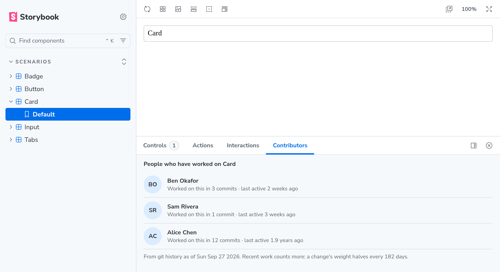

# Component Contributors

Find the right person to talk to about a component without leaving Storybook.

The **Contributors** panel lists the people who have worked on the component a story shows, most
relevant first. Use it to find someone to ask a question, request a review from, or get an update
from. You don't need git or any accounts: recent work counts most, and the list comes from your
repository's history when Storybook is built.



## Install

Requires Storybook 10.

```sh
npm install --save-dev storybook-addon-component-contributors
```

```ts
// .storybook/main.ts
export default {
  addons: ['storybook-addon-component-contributors'],
};
```

Run or build Storybook from a git checkout with full history. A static build keeps working after
you deploy it without the repository.

To change how quickly older work fades (default: a change's weight halves every 182 days):

```ts
addons: [{ name: 'storybook-addon-component-contributors', options: { halfLifeDays: 90 } }],
```
